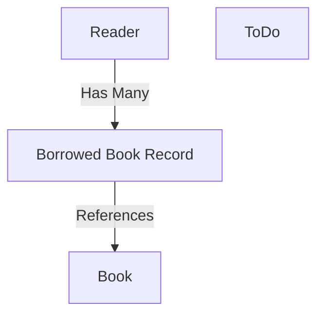

# Book Management API – Project Summary

## Overview

The Book Management API is a RESTful web service focused on delivering comprehensive book catalog management. It provides CRUD operations for books, including creation, retrieval, updates, and deletion. The system is suitable for library management systems, bookstores, or personal reading list managers. It adheres to REST principles, uses JSON for request/response formatting, and is easily consumable by web, mobile, or backend clients.

---

## Application Lifecycle

- **Initialization**: Loads environment variables from `.env` with dotenv.
- **Express setup**: Express app is configured with JSON parser and CORS.
- **Database connection**: Connects to MongoDB using Mongoose. The connection string is from environment or defaults to `mongodb://localhost:27017/book-management`.
- **Runtime**: Routes handled through Express middleware.
    - **Controllers**: Extract request data, invoke services, and handle HTTP responses/status.
    - **Services**: Perform business logic, validation, and database interaction.
    - **Models**: (Mongoose) define schema, constraints, validation.
- **Error Handling**: Consistently applies HTTP status codes (400, 404, 201, etc.).

---

## Entity Relationships

- **Book**: Title, author, published year, genre, availability status.
- **Reader**: Name, contact, and an array of borrowed books.
- **BorrowedBook**: References a Book (via ObjectId) with borrow metadata (dates, status).
- **ToDo**: Task list unrelated to primary entity structure.

---

## Key Application Modules

**Layered Structure**
- **Models**: Mongoose schema for Book, Reader, ToDo.
- **Services**: Business logic (e.g., bookService with full CRUD, reviewService as a placeholder).
- **Controllers**: HTTP logic, request parsing, error handling, response formatting.
- **Routes**: RESTful API mapping (`/books`, `/books/:id`, `/books/search`, etc.)

---

## Core Technologies and Packages

- **Node.js**  
- **Express** (HTTP server, routing, middleware)
- **Mongoose** (ODM, schema validation, MongoDB interaction)
- **MongoDB** (primary database)
- **dotenv** (environment management)
- **morgan** (request logging)
- **cors** (CORS handling)

---

## Database Information

- **MongoDB** with Mongoose model files.
- **Connections**:  
    - `config/db.js` → `mongodb://localhost:27017/bookstore`  
    - `server.js` → configurable via `MONGODB_URI` (default `book-management`)
- **Entities**:  
    - **Book**: title (string, req), author (string, req), publishedYear (number, req), genre (string, req), available (bool, default true).
    - **Reader**: name, contactInfo, borrowedBooks (ObjectId reference to Book, borrow/return/dueDate, status).
    - **ToDo**: title, description, dueDate, completed.
- **Validation**: Enforced via Mongoose schemas.
- **Migrations**: Handled manually via schema evolution. No dedicated migration/seed system in place.

---

## API Information

- **RESTful Endpoints**:  
    - `POST /books` (Create)
    - `GET /books` (List all)
    - `GET /books/:id` (Retrieve one)
    - `PUT /books/:id` (Full update)
    - `DELETE /books/:id` (Delete)
    - `GET /books/search` (Planned feature, not implemented)
- **Error Handling**: JSON format with HTTP codes.
- **Authentication/Authorization**: None implemented.
- **Routes**: Configured under `/routes/bookRoutes.js` and directly on the Express app.
- **Next.js route exists** at `/src/pages/api/books/[id].ts` (in-memory only, appears experimental).

---

## Summary

The Book Management API is a Node.js/Express/MongoDB-based application structured for clean, maintainable CRUD operations on books. It follows RESTful best practices, uses Mongoose for database modeling and validation, and demonstrates separation of concerns: models, services, controllers, routes.

Features under development include advanced search, book review system, and improved authentication. Future improvements recommended are:
- Implement authentication/authorization
- Complete search/review features
- Fix database connection config inconsistencies
- Comprehensive error/validation middleware
- Add migrations and seeders for production data handling