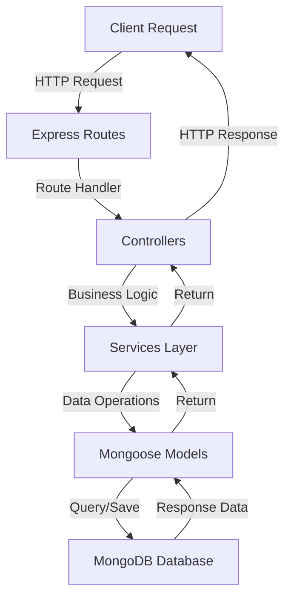

# Setup Instructions

This guide provides step-by-step instructions for setting up and running the Book Management application locally. The project is built with Node.js, Express, and MongoDB using Mongoose as the ORM.

## Prerequisites

Before you begin, ensure you have the following installed on your system:

**Node.js and npm**: This project requires Node.js to run the Express server and manage dependencies. You should have Node.js version 14 or higher installed along with npm (Node Package Manager).

**MongoDB**: The application uses MongoDB as its database with Mongoose for object modeling. You'll need either a local MongoDB installation (version 4.4 or higher recommended) or access to a MongoDB Atlas cloud instance.

**Git**: Required for cloning the repository from GitHub.

## Getting Started

### Clone the Repository

Begin by cloning the project repository to your local machine:

```bash
git clone https://github.com/chi-jitera/Book-management-1.git
cd Book-management-1
```

### Install Dependencies

Once you've navigated into the project directory, install all required npm packages. The project uses Express as the web framework, Mongoose for MongoDB integration, and several middleware packages including CORS for cross-origin requests, Morgan for logging, and body-parser for request parsing:

```bash
npm install
```

This command reads the `package.json` file and installs all dependencies including Express 4.21.2, Mongoose 8.10.2, and their associated packages.

### Environment Configuration

The project uses environment variables for configuration management through the dotenv package. Create a `.env` file in the root directory of the project:

```bash
touch .env
```

Configure the following environment variables in your `.env` file:

```
PORT=3000
MONGODB_URI=mongodb://localhost:27017/book-management
NODE_ENV=development
```

**Environment Variable Details:**

- `PORT`: The port number on which the Express server will run (default is 3000)
- `MONGODB_URI`: Your MongoDB connection string. For local development, use `mongodb://localhost:27017/book-management`. For MongoDB Atlas, use your cluster connection string
- `NODE_ENV`: Set to `development` for local development or `production` for production deployments

### Database Setup

Ensure your MongoDB service is running before starting the application. If you're using a local MongoDB installation, start the MongoDB service:

**On macOS (using Homebrew):**
```bash
brew services start mongodb-community
```

**On Linux (using systemd):**
```bash
sudo systemctl start mongod
```

**On Windows:**
```bash
net start MongoDB
```

If you're using MongoDB Atlas, ensure your connection string in the `.env` file includes the correct credentials and that your IP address is whitelisted in the Atlas security settings.

The application will automatically connect to MongoDB when it starts. Mongoose will create the database and collections as needed based on your schema definitions.

## Running the Application

### Development Mode

To start the application in development mode, use the start script defined in the package.json:

```bash
npm start
```

This command launches the Express server, which will listen on the port specified in your `.env` file (default: 3000). You should see console output indicating that the server is running and connected to MongoDB.

Once the server is running, you can access the application at:

```
http://localhost:3000
```

### Verifying the Setup

To verify that your setup is working correctly, you can check the following:

1. **Server Status**: Confirm that the Express server started without errors in your console output
2. **Database Connection**: Look for a successful MongoDB connection message in the logs
3. **API Endpoints**: Test the book management API endpoints using a tool like curl, Postman, or your web browser

Example API test using curl:

```bash
curl http://localhost:3000/api/books
```

## Project Structure Overview

The application follows a standard MVC architecture pattern with the following key directories:

- `models/`: Contains Mongoose schema definitions for MongoDB collections
- `controllers/`: Houses the business logic and request handlers
- `routes/`: Defines API endpoints and maps them to controller functions
- `services/`: Contains reusable business logic and data access layers
- `config/`: Stores configuration files and database connection setup
- `src/pages/api/`: Additional API route handlers



## Troubleshooting

**MongoDB Connection Issues**: If you encounter connection errors, verify that MongoDB is running and that your `MONGODB_URI` in the `.env` file is correct. Check that there are no firewall rules blocking the connection.

**Port Already in Use**: If port 3000 is already occupied, change the `PORT` value in your `.env` file to an available port number.

**Missing Dependencies**: If you see module not found errors, try removing the `node_modules` folder and `package-lock.json` file, then run `npm install` again.

**Environment Variables Not Loading**: Ensure your `.env` file is in the root directory of the project and that the variable names match exactly as specified above.

## Additional Information

The project uses several middleware packages that are automatically configured:

- **CORS**: Enables cross-origin resource sharing for API access from different domains
- **Morgan**: Provides HTTP request logging for debugging and monitoring
- **Body Parser**: Parses incoming request bodies in JSON and URL-encoded formats

These middleware components are integrated into the Express application and require no additional configuration beyond the standard setup process.